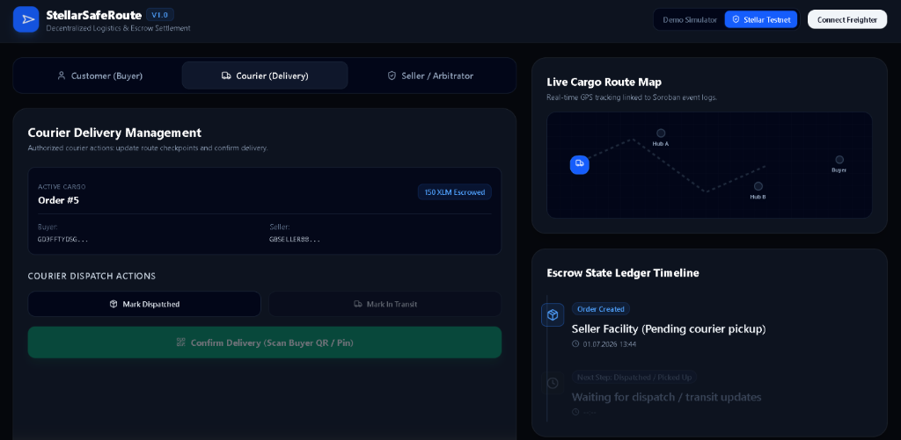
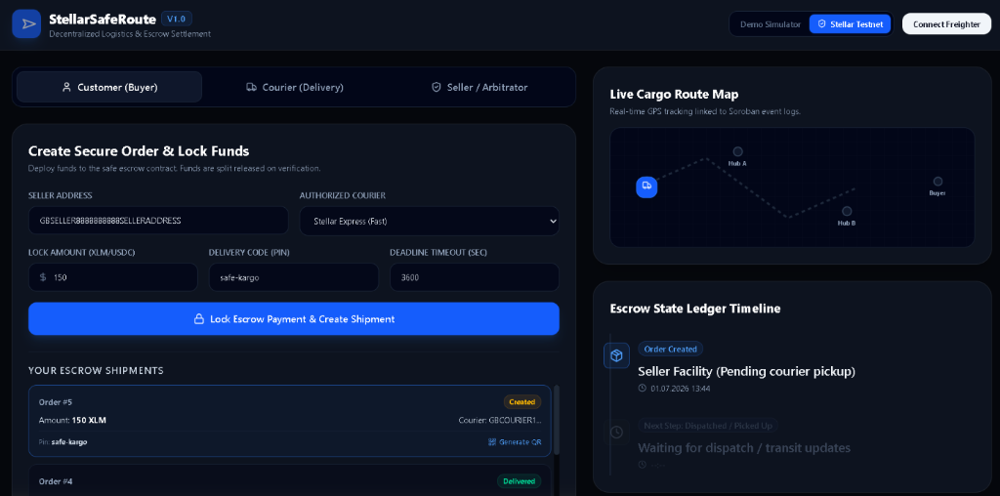
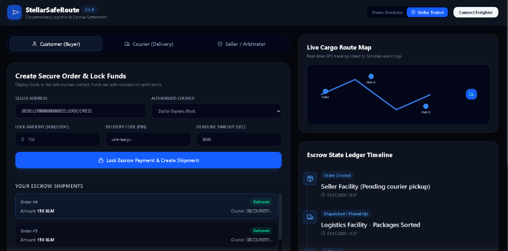
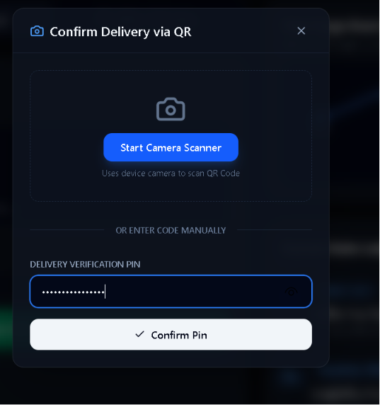
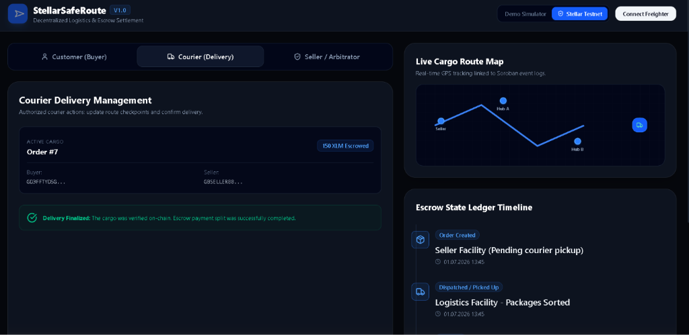
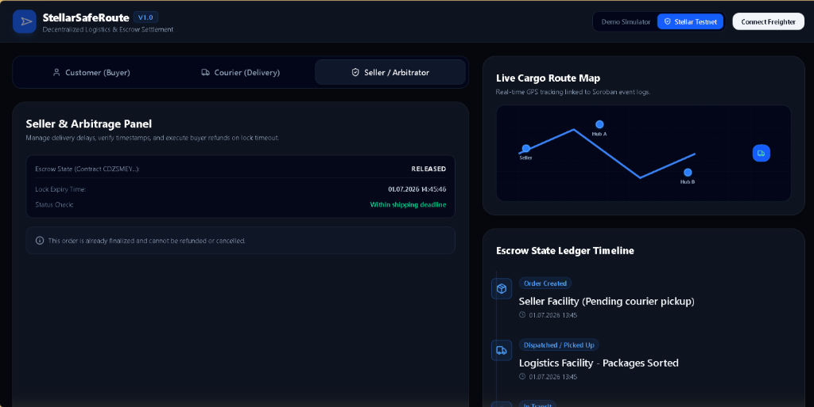

# 📦 StellarSafeRoute

**StellarSafeRoute**, Stellar Soroban akıllı sözleşmeleriyle güçlendirilmiş, merkeziyetsiz kargo lojistiği ve emanet (escrow) ödeme mutabakat sistemidir. 

Gerçek dünya ticari problemlerine odaklanarak tasarlanan bu dApp, alıcı kargoyu teslim alıp şifreli bir QR kod/pin ile doğrulayana kadar fonları güvenli bir emanet sözleşmesinde kilitli tutar. Teslimat gerçekleştiğinde fonlar otomatik olarak satıcı (%95) ve kurye (%5) arasında dağıtılır.

---

## 🏗️ Mimari Tasarım

Proje, birbirleriyle etkileşim kuran 3 ana Soroban akıllı sözleşmesinden oluşur:

1.  **`courier_registry` (Kurye Kayıt Defteri):** Kuryelerin sisteme kaydını, durum takibini (aktif/pasif) ve kurye puanlama sistemini yönetir.
2.  **`logistics_tracker` (Kargo Takip):** Kargoların oluşturulması, yol haritası üzerindeki ara noktaların (checkpoints) kurye tarafından güncellenmesi ve alıcıdan alınan pin kodunun SHA-256 doğrulamasını yönetir.
3.  **`cargo_escrow` (Güvenli Ödeme / Escrow):** Alıcıdan gelen fonları kilitler. Kargo teslimatı doğrulandığında, fonları satıcı (%95) ve kurye (%5) arasında paylaştırarak dağıtır. Teslimat süresi aşılırsa alıcıya iade (refund) hakkı tanır.

---

## 🌎 Stellar Testnet Dağıtım Bilgileri (Deployed Addresses)

Sözleşmeler **Stellar Testnet** ağına dağıtılmış ve başlatılmıştır (initialized):

*   **`courier_registry` Adresi:** `CANBT6GBDP4FF5XFD2MICVLERF6U4RDLAALDS5TGQNL7JMV44PATKIMQ`
*   **`logistics_tracker` Adresi:** `CBA42BBQQLZHAGNUEJL3PPJB7POARSANT5ZJBYYRFVIQPEPOCGKZ2LQH`
*   **`cargo_escrow` Adresi:** `CDZSMEY5UL5XLWNG2D4F62BGZPJSX5RHJIWSAKQNTIHBYDLMDRZWTUS4`

---

## 🛠️ Kurulum ve Çalıştırma

### 1. Akıllı Sözleşmeler (Rust)
Geliştirme ortamında sözleşmeleri derlemek ve test etmek için:

```bash
# Testleri çalıştırın
cargo test

# Sözleşmeleri derleyin (Stellar Soroban uyumlu)
stellar contract build
```

### 2. Arayüz (React + Vite + Tailwind CSS)
Web arayüzünü başlatmak için:

```bash
cd frontend

# Bağımlılıkları yükleyin
npm install

# Geliştirme sunucusunu başlatın
npm run dev
```

---

## 🚀 Öne Çıkan Özellikler

*   **Güvenli O2O QR Doğrulaması:** Teslimat anında alıcı bir QR kod gösterir. Kurye bu QR kodu mobil kamerasıyla taradığında (veya manuel kodu girdiğinde) SHA-256 hash doğrulaması blockchain üzerinde çalışır ve ödemeyi otomatik çözer.
*   **Kullanıcı Dostu Demo Simülatörü:** Freighter cüzdanı yüklü olmayan kullanıcılar için anında test imkanı sunan bir **Demo Simülatör Modu** entegre edilmiştir. Freighter cüzdanı algılandığında sistem otomatik olarak canlı Stellar Testnet moduna geçiş yapabilir.
*   **Görsel Zaman Tüneli & Canlı Harita:** Kurye kargo durumunu güncelledikçe haritadaki araç simgesi hareket eder ve işlem zaman tüneline yansır.

---

## 📸 Ekran Görüntüleri (Screenshots)

Uygulamanın uçtan uca çalışma akışını ve arayüz detaylarını gösteren ekran görüntüleri `./screenshots/` klasöründe yer almaktadır:

1.  **Müşteri Sipariş Oluşturma (Buyer):**  - Alıcının emanet ödemesini kilitlediği ve kargo siparişini başlattığı ekran.
2.  **Kurye Atama ve Kabul (Courier):**  - Siparişin kuryeye atandığı ve kurye panelinde göründüğü ekran.
3.  **Transit Yolculuk ve Harita (Transit):**  - Kuryenin durumu güncellediği ve harita üzerindeki kamyonun hareket ettiği an.
4.  **Teslimat PIN/QR Doğrulama (QR Verification):**  - Kurye teslimat adresine ulaştığında açılan doğrulama ekranı.
5.  **Teslimat Tamamlandı (Delivery Finalized):**  - Şifre doğrulandıktan sonra escrow kilidinin çözüldüğünü gösteren ekran.
6.  **Hakem ve Dağıtılan Fonlar (Escrow Released):**  - Fonların dağıtıldığını ve escrow durumunun `RELEASED` olduğunu gösteren ekran.

### Diğer Ekran Görüntüleri ve Demo Videosu:
*   🎥 **1-2 Dakikalık Demo Videosu:** [StellarSafeRoute Demo Videosu (Google Drive)](https://drive.google.com/file/d/1P0ghtiten5Qg3E8T4xhPSm_h0V5yyKA7/view?usp=sharing)
*   ⚙️ **Çalışan CI/CD Hattı:** 
*   🧪 **Başarılı Test Çıktısı (3+ Test):** 

